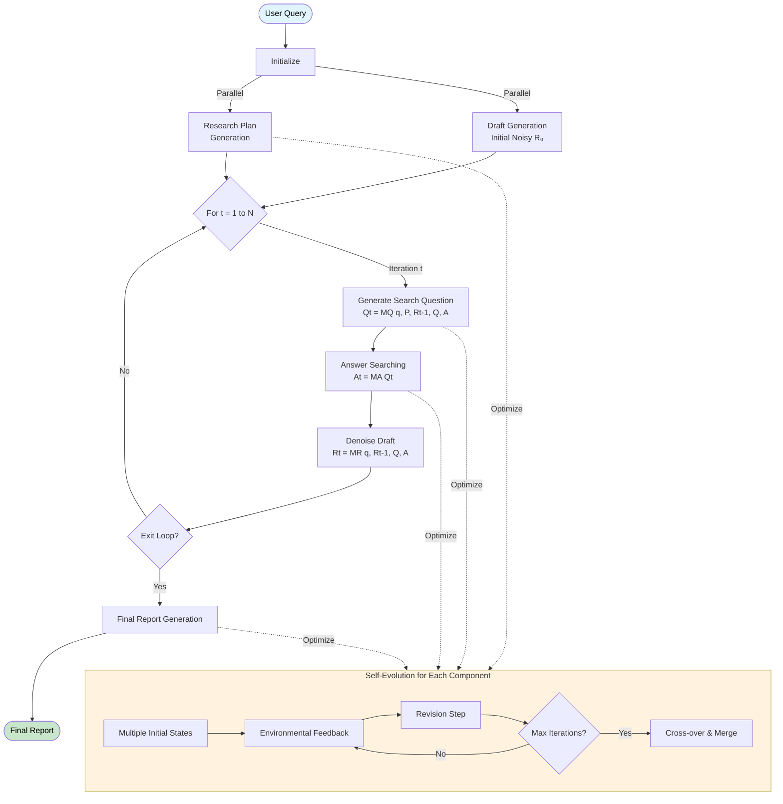

# TTD-DR (Test-Time Diffusion Deep Researcher) on Dify

A simple implementation of Test-Time Diffusion Deep Researcher on [Dify](https://dify.ai/), a low-code LLM application development platform.

## About This Repository

This repository demonstrates how to implement TTD-DR using Dify's visual workflow system. The implementation is provided as a Dify workflow file (`TTD-DR.yml`) that can be imported directly into your Dify workspace.

## What is TTD-DR?

TTD-DR revolutionizes deep research by conceptualizing report writing as an iterative diffusion process, similar to how diffusion models denoise images. It starts with a preliminary "noisy" draft and progressively refines it through retrieval-augmented denoising steps, mimicking the natural human writing process of planning, drafting, and multiple revisions.

## Key Innovation

Unlike traditional linear research agents (plan → search → write), TTD-DR maintains an evolving draft throughout the entire research process. This draft serves as both:
- A guide for research direction (informing what to search next)
- An evolving foundation that gets progressively refined with new information

## Core Mechanisms

### 1. Denoising with Retrieval (Report-Level Refinement)
- **Initial Draft**: Starts with a preliminary report based on LLM's internal knowledge
- **Iterative Refinement**: Each iteration:
  - Current draft → generates targeted search queries
  - Retrieves external information
  - Information + previous draft → refined draft
- **Continuous Feedback Loop**: The evolving draft dynamically guides the research direction

### 2. Self-Evolution (Component-Level Optimization)
- Each component (plan, question, answer, report) undergoes optimization
- Multiple variants are generated, evaluated, and merged
- Provides high-quality context for the diffusion process
- Encourages exploration of diverse knowledge paths

## How It Works

### Workflow Overview



### Simplified Workflow

```
User Query → [Initial Draft R₀ + Research Plan]
    ↓
For each iteration t:
    Draft Rₜ → Generate Search Question
    Search Question → Retrieve Information
    Retrieved Info + Draft Rₜ → Denoised Draft Rₜ₊₁
    ↓
Final Report Generation
```

### Detailed Algorithm

```
Algorithm 1: Denoising with Retrieval
--------------------------------------
Input: q, M, P, R₀, Q, A
    ▷ query, all agents, plan, initial noisy draft, history of search questions and answers

For t ∈ {1, ..., N} do:                     ▷ N: max number of revision steps
    Qt = MQ(q, P, Rt-1, Q, A)               ▷ generate the next question to address gaps in Rt
    Qt → Q
    At = MA(Qt)                             ▷ retrieve external information to provide concrete delta for denoising
    At → A
    Rt = MR(q, Rt-1, Q, A)                  ▷ remove "noise" (imprecision, incompleteness) from the previous draft
    
    if exit_loop then
        break                               ▷ if exit_loop is called, stop revision
    end if
end for

Output: Final refined report Rt
```

### Hyper-Parameters

| Parameter | Description | Default Value | Configurable |
|-----------|-------------|---------------|--------------|
| N | Maximum number of denoising iterations | 2 | Yes |
| n_p | Number of initial plan states | 1 | No |
| n_q | Number of initial search query states | 5 | No |
| n_a | Number of initial answer states | 3 | No |
| n_r | Number of initial report states | 1 | No |
| s_p | Plan self-evolving steps | 2 | Yes |
| s_q | Search query self-evolving steps | 0 | No |
| s_a | Answer self-evolving steps | 0 | No |
| s_r | Report self-evolving steps | 0 | No |

## Why TTD-DR?

- **Human-Inspired**: Mimics how humans actually write - plan, draft, seek information, revise
- **Coherent Integration**: Maintains consistency through the evolving draft
- **Reduced Information Loss**: Progressive integration preserves valuable findings
- **Timely Synthesis**: Incorporates information when most relevant, not just at the end
- **Superior Performance**: Outperforms existing deep research agents on benchmarks

## Installation & Setup

### Prerequisites
- Dify account and workspace
- Required plugins (install from Dify Plugin Marketplace):
  - OpenAI plugin (with API key configured)
  - Agent Strategies plugin
  - Tavily Search plugin (with API key configured)

### Steps
1. **Install Required Plugins**
   - Navigate to Dify Plugin Marketplace
   - Install the OpenAI plugin
   - Install the Agent Strategies plugin  
   - Install the Tavily Search plugin

2. **Configure Plugin Settings**
   - Add your OpenAI API key to the OpenAI plugin
   - Add your Tavily API key to the Tavily Search plugin
   - Enable Agent Strategies plugin

3. **Import the Workflow**
   - Go to your Dify workspace
   - Click "Import DSL file" and upload the `TTD-DR.yml` file
   
4. **Adjust Parameters** (Optional)
   - Modify diffusion parameters as needed
   - Customize the number of iterations and evolution steps

## Limitations

### Current Implementation Constraints

1. **Limited Parameter Configuration**: Due to Dify platform constraints and implementation choices, certain hyperparameters from the original paper are not fully configured:
   - Cannot dynamically generate multiple variant states (n_p, n_q, n_a, n_r) within the workflow due to lack of dynamic node generation capability
   - Self-evolution steps (s_q, s_a, s_r) are simplified compared to the paper's implementation due to lack of nested loop support
   - No retry mechanism to validate structured JSON output elements match expected schema
   - Agent parameters (temperature, top_k, etc.) are not configured for diverse search space exploration, though the platform supports this

2. **Report Revision Approach**: The current implementation rewrites the entire report during each denoising iteration. A more efficient and human-like approach would be:
   - Extract specific sections that need improvement
   - Use targeted agents to revise only those sections
   - Preserve well-written portions while enhancing weak areas
   - This would better mimic how humans actually revise drafts (editing specific paragraphs rather than rewriting everything)

### Future Improvements

- Implement selective text replacement functionality
- Add extraction agents to identify sections needing revision
- Create more granular control over self-evolution parameters

## Paper Reference

Based on ["Deep Researcher with Test-Time Diffusion"](https://arxiv.org/abs/2507.16075) (arXiv:2507.16075v1)

Authors: Rujun Han, Yanfei Chen, et al. - Google Cloud AI Research