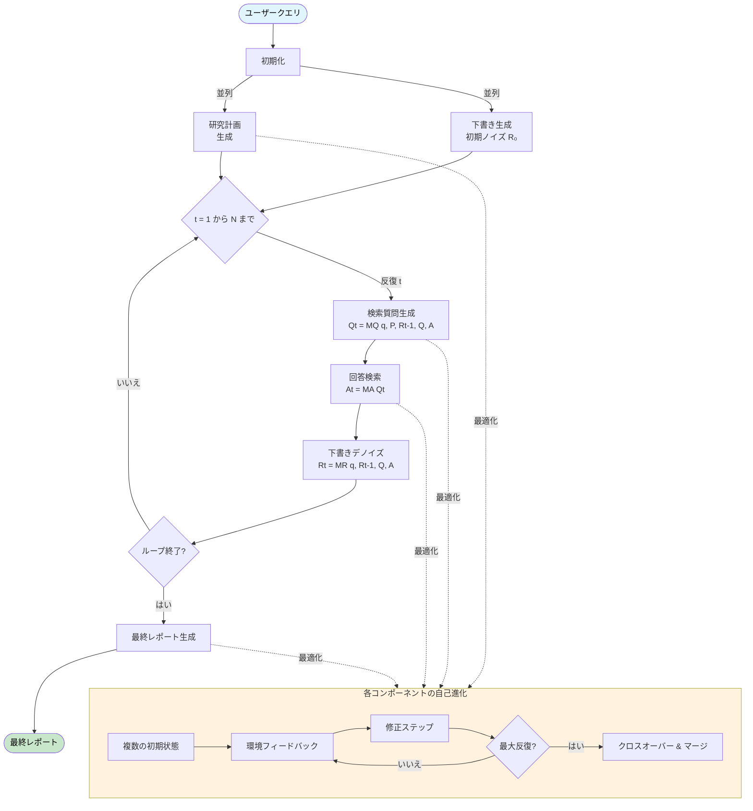

# TTD-DR (Test-Time Diffusion Deep Researcher) on Dify

[Dify](https://dify.ai/)（ローコードLLMアプリケーション開発プラットフォーム）上でTest-Time Diffusion Deep Researcherのシンプルな実装。

## このリポジトリについて

このリポジトリは、Difyのビジュアルワークフローシステムを使用してTTD-DRを実装する方法を示しています。実装はDifyワークフローファイル（`TTD-DR.yml`）として提供され、Difyワークスペースに直接インポートできます。

## TTD-DRとは？

TTD-DRは、レポート作成を拡散モデルがノイズのある画像をデノイズする方法と同様の反復的な拡散プロセスとして概念化することで、深層研究に革命をもたらします。人間の自然な執筆プロセス（計画、下書き、複数回の修正）を模倣し、予備的な「ノイズのある」下書きから始まり、検索拡張デノイジングステップを通じて段階的に洗練させていきます。

## なぜTTD-DRなのか？

- **人間にインスパイアされた**：人間が実際に書く方法を模倣 - 計画、下書き、情報検索、修正
- **一貫した統合**：進化する下書きを通じて一貫性を維持
- **情報損失の削減**：段階的な統合により貴重な発見を保持
- **タイムリーな統合**：最後だけでなく、最も関連性の高い時に情報を組み込む
- **優れたパフォーマンス**：既存の深層研究エージェントを上回る

## 主要な革新

従来の線形研究エージェント（計画→検索→執筆）とは異なり、TTD-DRは研究プロセス全体を通じて進化する下書きを維持します。この下書きは以下の両方の役割を果たします：
- 研究の方向性を導くガイド（次に何を検索するかを知らせる）
- 新しい情報で段階的に洗練される進化する基盤

## コアメカニズム

### 1. 検索によるデノイジング（レポートレベルの洗練）
- **初期下書き**：LLMの内部知識に基づく予備レポートから開始
- **反復的な洗練**：各反復で：
  - 現在の下書き→ターゲット検索クエリを生成
  - 外部情報を取得
  - 情報＋前の下書き→洗練された下書き
- **継続的なフィードバックループ**：進化する下書きが動的に研究の方向性を導く

### 2. 自己進化（コンポーネントレベルの最適化）
- 各コンポーネント（計画、質問、回答、レポート）が最適化を受ける
- 複数のバリアントが生成、評価、マージされる
- 拡散プロセスのための高品質なコンテキストを提供
- 多様な知識パスの探索を促進

## 動作の仕組み

### ワークフローの概要



### 簡略化されたワークフロー

```
ユーザークエリ → [初期下書き R₀ + 研究計画]
    ↓
各反復 t において：
    下書き Rₜ → 検索質問を生成
    検索質問 → 情報を取得
    取得した情報 + 下書き Rₜ → デノイズされた下書き Rₜ₊₁
    ↓
最終レポート生成
```

### 詳細なアルゴリズム

```
アルゴリズム 1: 検索によるデノイジング
--------------------------------------
入力: q, M, P, R₀, Q, A
    ▷ クエリ、全エージェント、計画、初期ノイズ下書き、検索質問と回答の履歴

For t ∈ {1, ..., N} do:                     ▷ N: 最大修正ステップ数
    Qt = MQ(q, P, Rt-1, Q, A)               ▷ Rtのギャップに対処する次の質問を生成
    Qt → Q
    At = MA(Qt)                             ▷ デノイジングの具体的な差分を提供する外部情報を取得
    At → A
    Rt = MR(q, Rt-1, Q, A)                  ▷ 前の下書きから「ノイズ」（不正確さ、不完全さ）を除去
    
    if exit_loop then
        break                               ▷ exit_loopが呼ばれた場合、修正を停止
    end if
end for

出力: 最終的な洗練されたレポート Rt
```

### ハイパーパラメータ

| パラメータ | 説明 | デフォルト値 | 設定可能 |
|-----------|-----|-------------|---------|
| N | 最大デノイジング反復回数 | 2 | はい |
| n_p | 初期計画状態の数 | 1 | いいえ |
| n_q | 初期検索クエリ状態の数 | 5 | いいえ |
| n_a | 初期回答状態の数 | 3 | いいえ |
| n_r | 初期レポート状態の数 | 1 | いいえ |
| s_p | 計画自己進化ステップ | 2 | はい |
| s_q | 検索クエリ自己進化ステップ | 0 | いいえ |
| s_a | 回答自己進化ステップ | 0 | いいえ |
| s_r | レポート自己進化ステップ | 0 | いいえ |

## インストールとセットアップ

### 前提条件
- Difyアカウントとワークスペース
- 必要なプラグイン（Difyプラグインマーケットプレイスからインストール）：
  - OpenAIプラグイン（APIキー設定済み）
  - Agent Strategiesプラグイン
  - Tavily Searchプラグイン（APIキー設定済み）

### 手順
1. **必要なプラグインをインストール**
   - Difyプラグインマーケットプレイスに移動
   - OpenAIプラグインをインストール
   - Agent Strategiesプラグインをインストール
   - Tavily Searchプラグインをインストール

2. **プラグイン設定を構成**
   - OpenAIプラグインにOpenAI APIキーを追加
   - Tavily SearchプラグインにTavily APIキーを追加
   - Agent Strategiesプラグインを有効化

3. **ワークフローをインポート**
   - Difyワークスペースに移動
   - 「DSLファイルをインポート」をクリックし、`TTD-DR.yml`ファイルをアップロード
   
4. **パラメータを調整**（オプション）
   - 必要に応じて拡散パラメータを変更
   - 反復回数と進化ステップをカスタマイズ

## 制限事項

### 現在の実装の制約

1. **限定的なパラメータ設定**：Difyプラットフォームの制約と実装の選択により、元の論文の特定のハイパーパラメータが完全に設定されていません：
   - 動的ノード生成機能がないため、ワークフロー内で複数のバリアント状態（n_p, n_q、n_a、n_r）を動的に生成できない
   - ネストループのサポートがないため、自己進化ステップ（s_q、s_a、s_r）が論文の実装と比較して簡略化されている
   - 構造化JSON出力要素が期待されるスキーマと一致することを検証するリトライメカニズムがない
   - エージェントパラメータ（温度、top_kなど）は、プラットフォームがサポートしているものの、多様な検索空間の探索のために設定されていない

2. **レポート修正アプローチ**：現在の実装は、各デノイジング反復でレポート全体を書き直します。より効率的で人間らしいアプローチは：
   - 改善が必要な特定のセクションを抽出
   - それらのセクションのみを修正するターゲット指向のエージェントを使用
   - 弱い部分を強化しながら、よく書かれた部分を保持
   - これにより、人間が実際に下書きを修正する方法（すべてを書き直すのではなく、特定の段落を編集する）をよりよく模倣できる

### 将来の改善

- 選択的テキスト置換機能の実装
- 修正が必要なセクションを特定する抽出エージェントの追加
- 自己進化パラメータのよりきめ細かな制御の作成
- プラットフォームの制限を克服するカスタムDifyプラグインの開発

## 論文参照

["Deep Researcher with Test-Time Diffusion"](https://arxiv.org/abs/2507.16075) (arXiv:2507.16075v1) に基づく

著者: Rujun Han, Yanfei Chen, et al. - Google Cloud AI Research