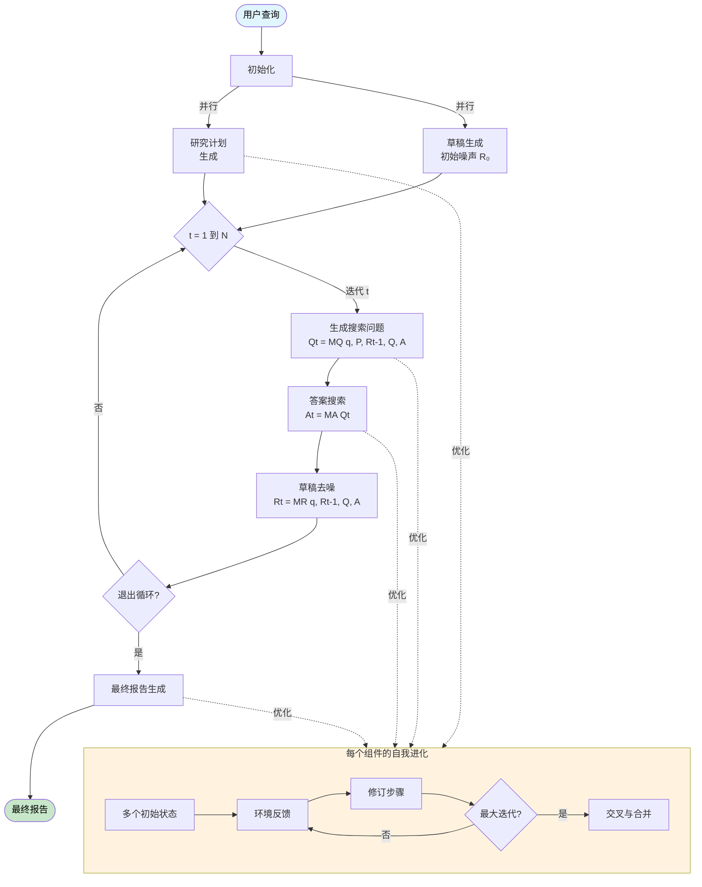

# TTD-DR (Test-Time Diffusion Deep Researcher) on Dify

在[Dify](https://dify.ai/)（低代码LLM应用开发平台）上实现的Test-Time Diffusion Deep Researcher简单实现。

## 关于本仓库

本仓库演示了如何使用Dify的可视化工作流系统实现TTD-DR。实现以Dify工作流文件（`TTD-DR.yml`）的形式提供，可以直接导入到您的Dify工作空间中。

## 什么是TTD-DR？

TTD-DR通过将报告撰写概念化为迭代扩散过程，彻底改变了深度研究方式，类似于扩散模型对图像去噪的方式。它从初步的"带噪声"草稿开始，通过检索增强的去噪步骤逐步优化，模仿人类自然的写作过程：计划、起草和多次修订。

## 核心创新

与传统的线性研究代理（计划→搜索→撰写）不同，TTD-DR在整个研究过程中维护一个不断演化的草稿。这个草稿同时起到两个作用：
- 研究方向的指南（指导下一步搜索什么）
- 随着新信息逐步完善的演化基础

## 核心机制

### 1. 检索去噪（报告级别优化）
- **初始草稿**：从基于LLM内部知识的初步报告开始
- **迭代优化**：每次迭代：
  - 当前草稿→生成目标搜索查询
  - 检索外部信息
  - 信息+之前的草稿→优化后的草稿
- **持续反馈循环**：演化的草稿动态引导研究方向

### 2. 自我进化（组件级别优化）
- 每个组件（计划、问题、答案、报告）都经历优化
- 生成、评估和合并多个变体
- 为扩散过程提供高质量的上下文
- 鼓励探索多样化的知识路径

## 工作原理

### 工作流概述



### 简化的工作流

```
用户查询 → [初始草稿 R₀ + 研究计划]
    ↓
对于每次迭代 t：
    草稿 Rₜ → 生成搜索问题
    搜索问题 → 检索信息
    检索的信息 + 草稿 Rₜ → 去噪后的草稿 Rₜ₊₁
    ↓
最终报告生成
```

### 详细算法

```
算法 1：检索去噪
--------------------------------------
输入: q, M, P, R₀, Q, A
    ▷ 查询、所有代理、计划、初始带噪草稿、搜索问题和答案的历史记录

For t ∈ {1, ..., N} do:                     ▷ N: 最大修订步骤数
    Qt = MQ(q, P, Rt-1, Q, A)               ▷ 生成下一个问题以解决Rt中的空白
    Qt → Q
    At = MA(Qt)                             ▷ 检索外部信息为去噪提供具体的增量
    At → A
    Rt = MR(q, Rt-1, Q, A)                  ▷ 从之前的草稿中去除"噪声"（不精确、不完整）
    
    if exit_loop then
        break                               ▷ 如果调用exit_loop，停止修订
    end if
end for

输出: 最终优化的报告 Rt
```

### 超参数

| 参数 | 描述 | 默认值 | 可配置 |
|------|------|--------|--------|
| N | 最大去噪迭代次数 | 2 | 是 |
| n_p | 初始计划状态数 | 1 | 否 |
| n_q | 初始搜索查询状态数 | 5 | 否 |
| n_a | 初始答案状态数 | 3 | 否 |
| n_r | 初始报告状态数 | 1 | 否 |
| s_p | 计划自我进化步骤 | 2 | 是 |
| s_q | 搜索查询自我进化步骤 | 0 | 否 |
| s_a | 答案自我进化步骤 | 0 | 否 |
| s_r | 报告自我进化步骤 | 0 | 否 |

## 为什么选择TTD-DR？

- **受人类启发**：模仿人类实际的写作方式 - 计划、起草、搜索信息、修订
- **连贯集成**：通过演化的草稿保持一致性
- **减少信息损失**：渐进式集成保留有价值的发现
- **及时综合**：在最相关的时候而不是仅在最后纳入信息
- **卓越性能**：超越现有的深度研究代理

## 性能表现

TTD-DR实现了最先进的结果：
- 在LongForm Research上相对OpenAI Deep Research的胜率为**69.1%**
- 在DeepConsult基准测试上的胜率为**74.5%**
- 在HLE-Search上的准确率为**33.9%**（相比OpenAI DR的29.1%）

## 安装与设置

### 前提条件
- Dify账户和工作空间
- 必需的插件（从Dify插件市场安装）：
  - OpenAI插件（已配置API密钥）
  - Agent Strategies插件
  - Tavily Search插件（已配置API密钥）

### 步骤
1. **安装必需的插件**
   - 导航到Dify插件市场
   - 安装OpenAI插件
   - 安装Agent Strategies插件
   - 安装Tavily Search插件

2. **配置插件设置**
   - 将您的OpenAI API密钥添加到OpenAI插件
   - 将您的Tavily API密钥添加到Tavily Search插件
   - 启用Agent Strategies插件

3. **导入工作流**
   - 转到您的Dify工作空间
   - 点击"导入DSL文件"并上传`TTD-DR.yml`文件
   
4. **调整参数**（可选）
   - 根据需要修改扩散参数
   - 自定义迭代次数和进化步骤

## 配置

### 主要配置选项

- **去噪步骤（N）**：草稿优化的最大迭代次数（默认：20）
- **自我进化状态**：每个组件的变体生成数（参见上面的参数表）
- **检索深度**：信息收集的全面性
- **草稿初始化**：起点质量控制

## 限制

### 当前实现的约束

1. **有限的参数配置**：由于Dify的限制（不支持嵌套循环节点，没有动态节点生成能力），无法完全配置原论文中的所有超参数。具体而言：
   - 无法在工作流中动态生成多个变体状态（n_q、n_a、n_r）
   - 自我进化步骤（s_q、s_a、s_r）相比论文的实现有所简化
   - Dify没有重试回退机制来强制结构化输出元素的数量满足要求
   - 当前实现未配置代理参数（如温度、top_k）来探索论文中描述的多样化搜索空间

2. **报告修订方法**：当前实现在每次去噪迭代中重写整个报告。更高效和类人的方法应该是：
   - 提取需要改进的特定部分
   - 使用针对性的代理仅修改这些部分
   - 在增强薄弱部分的同时保留写得好的部分
   - 这样可以更好地模仿人类实际修改草稿的方式（编辑特定段落而不是重写所有内容）

### 未来改进

- 实现选择性文本替换功能
- 添加提取代理以识别需要修订的部分
- 创建对自我进化参数更精细的控制
- 开发自定义Dify插件以克服平台限制

## 论文参考

基于["Deep Researcher with Test-Time Diffusion"](https://arxiv.org/abs/2507.16075) (arXiv:2507.16075v1)

作者：Rujun Han, Yanfei Chen, et al. - Google Cloud AI Research